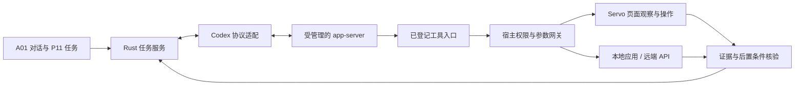

# Codex 内嵌智能体载体

用户确认的方向：复用 Codex 内核承载智能体，减少自建运行循环。Rust + Servo 仍承担浏览器和本地业务运行时。首次接入建议采用宿主管理的 Codex app-server 子进程与私有 stdio；“内嵌”指随产品管理生命周期，不预设稳定的 Rust 库链接 API。

## 已核对与待验证

本机 `codex --version` 返回 0.153.4；`codex app-server --help` 标注 experimental，并提供 stdio 与 schema 生成能力。本轮没有启动模型会话、读取账号凭据或验证浏览器工具循环。上游入口：[Codex](https://github.com/openai/codex)、[app-server 文档](https://github.com/openai/codex/blob/main/codex-rs/app-server/README.md)。滚动上游不能作为固定协议保证，实施时固定版本、生成 schema、验证握手与事件。

## 责任划分

| 主体 | 负责 | 不替代 |
|---|---|---|
| Codex | 任务推理、上下文、工具选择及其运行事件 | 浏览器账号隔离、业务提交凭证 |
| 协议适配 | 产品 task 与 thread/turn 关联、事件归一、版本协商、取消 | 凭文本猜执行结果 |
| Rust 宿主 | 工具权限、参数、页面版本、profile 锁、执行账本 | 不执行网页里的授权指令 |
| 业务应用 | 字段、草稿、幂等键、结果核对与补偿 | 不让通用 Agent 改业务约束 |

Planner/Executor/Evaluator 是逻辑职责，首期不强制多个独立模型。需要多 Agent 时交接目标、证据、预算、版本、作用域和未决动作；对同账号的写入串行。不能以重复执行达成所谓容错。

## 产品状态与流程

P17 显示未配置、连接中、可用、需认证、不兼容、进程故障；普通用户看到可操作原因，不看到协议堆栈。用户主动配置产品自己的认证/提供者；不得默认复制当前 Codex 桌面账号文件，也不承诺现有订阅权益可转移。

每个任务持久化产品 ID、Codex 会话映射、事件序号、预算、证据引用与未决动作。断连先重连并查询状态；发现可能已提交则进入核对，不再发一遍。工具暂不支持时显示具体能力不可用。

Codex 的工具批准与产品 G03 具体提交确认分层映射，避免两次不知所云的“继续”。宿主始终复核确认摘要、账号、页面版本与有效期；Codex 侧批准不能扩大本地权限。禁止向模型暴露 Cookie、密码和非必要页面数据。

## 接入门禁

- 固定可再分发版本、依赖与许可信息，验证打包/启动/退出/故障恢复。
- 用固定 schema 验证会话创建、增量消息、工具请求、错误、取消和断连。
- 跑通一次真实模型 → 只读观察 → 工具结果 → 产品任务完成。
- 跑通一次准备提交 → 用户确认 → 受控写入 → 结果核对；取消及摘要变化必须阻断。
- 离线/认证失败不影响本地应用与普通浏览；全进程性能按实测登记。

上述是验收任务，均不因安装了 codex CLI 自动完成。
