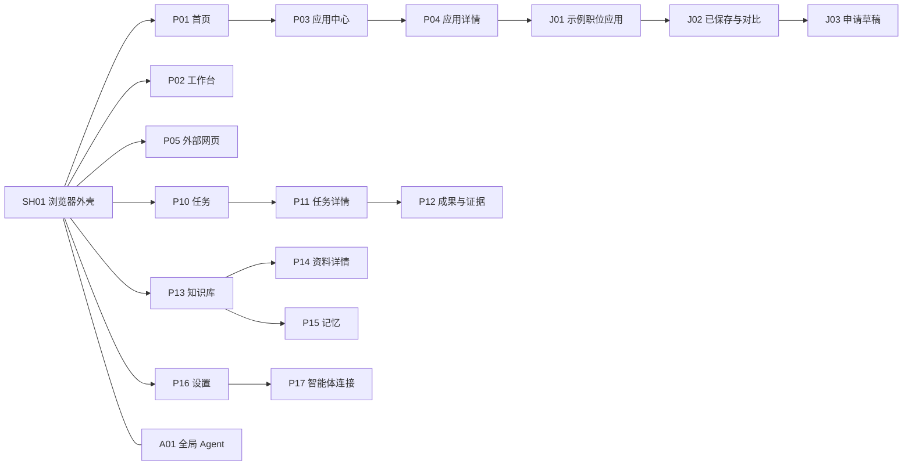

# 导航与信息架构

## 固定主导航

| 一级入口 | 默认落点 | 二级内容 | 区分依据 |
|---|---|---|---|
| 首页 | P01-01 | 应用快捷入口、最近工作、待处理 | 去哪里开始 |
| 工作台 | P02-01 | 进行中、已保存；应用中心 P03 | 我正在做什么 |
| 任务 | P10-01 | 任务详情 P11、成果 P12 | Agent 做了什么、还需我做什么 |
| 知识库 | P13-01 | 资料详情 P14、记忆 P15 | 内容资料与可编辑偏好分开 |
| 历史 | P07-01 | 按时间、域名搜索网页记录 | 浏览记录，不混入任务日志 |
| 下载 | P08-01 | 进行中、完成与失败 | 文件落盘状态 |
| 设置 | P16-01 | 网站账号 P09、智能体 P17、工具 P18、版本恢复 P19 | 当前身份和可用能力 |

书签在顶部书签栏及浏览器菜单进入 P06，不重复占用一级导航。应用中心通过首页“全部应用”和工作台进入。产品配置 P20 属于 V1.1 的产品维护者入口，普通用户不显示。Agent 面板 A01 是全局辅面，不是第八个一级页面。

## 对象、作用域和选择

- 工作空间组织应用、任务、资料、记忆；网站 profile 隔离站点会话。二者有明确关联，但不是同一个对象。
- 标签承载一个页面实例；应用可以有多个实体页，打开同一对象默认定位已有标签，用户可明确另开。
- 任务绑定创建时的工作空间、profile、上下文和授权。切换前台标签不会默默替换运行任务的目标。
- Agent 面板标题显示关联任务和所用页面。用户选择“使用当前页面”才更新下一次输入的上下文；已有批准不随切换继承。
- 关闭标签时说明受影响任务：依赖页面的任务暂停或提示保留；独立后台任务仍在任务中心可见。
- 首页卡片是入口，工作台条目是工作对象，任务卡是执行实例；同一对象使用统一 ID，避免三处维护副本。

## 路由合同

本地路由规划为 `/home`、`/workspace`、`/apps/:app_id`、`/tasks/:task_id`、`/knowledge/:document_id`、`/settings/:section`；职位示例位于自身应用命名空间。它们是产品路由设计，不声称已提供 Servo 协议处理器。

所有深链先解析工作空间和对象权限，再显示实体；不存在显示原对象不可访问，不自动打开别的记录。列表筛选和选中项可恢复，敏感内容不编码到 URL。前进/后退只改变导航，不重放写入。遮罩关闭恢复焦点，页面返回恢复筛选及滚动。
