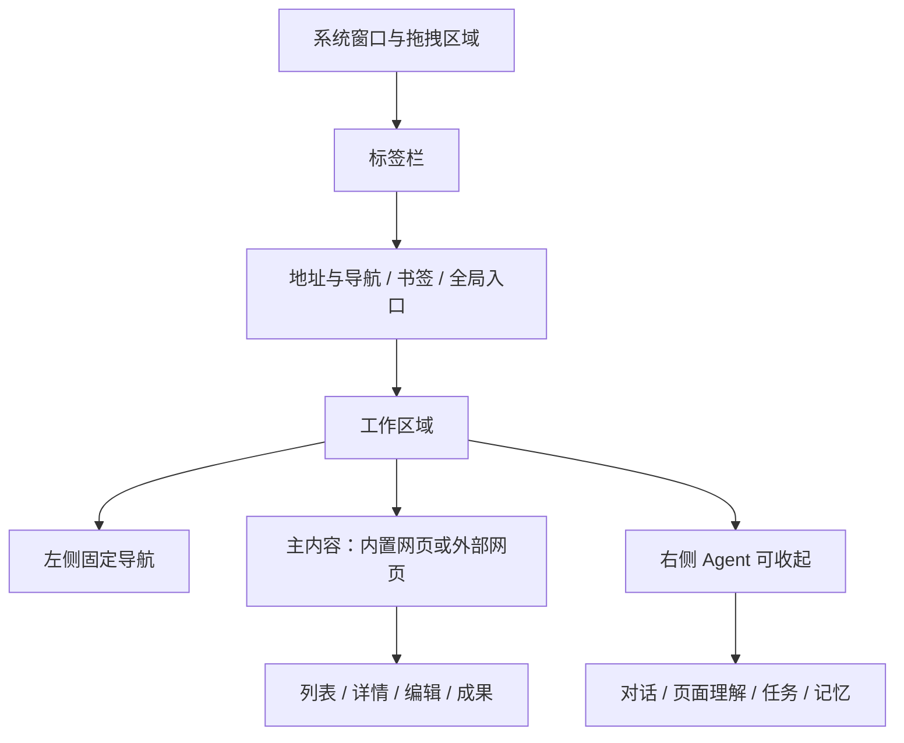

# 界面结构与视觉合同

视觉沿用已提供的青绿色浏览器参考图：主色约 #008C85，白色内容面、浅灰背景、深色正文。参考图 1774×887；宽屏工作视口参考 1920×962。Desktop 1280×1024、Tablet 768×1024、Mobile 390×884 用于布局验证，不代表本期交付移动端安装包。

## 三个稳定区域

外壳管理真实窗口、标签、地址、焦点和导航。内置网页负责应用功能。第三方网页保持自身页面结构；不得在外部网页 HTML 中注入一整套假的浏览器顶栏。图示顶部的地址和标签都应真实联动，而不是装饰。

## 尺寸与布局建议

| 区域 | 宽屏建议 | 缩窄规则 |
|---|---|---|
| 顶部 | 标签约 40、地址约 48、书签约 32 CSS px | 书签可隐藏；标签溢出滚动/菜单 |
| 左侧 | 展开约 152；紧凑约 64 | 先紧凑，窄屏改导航面板 |
| Agent | 默认约 400–460，可拖拽 | 主内容不足约 720 时改覆盖面，避免挤坏业务 |
| 职位列表 | 约 320–400 | 列表/详情切换，保留选中项 |
| 详情 | 使用剩余空间，限制正文行宽 | 独立滚动；窄屏返回列表 |

这些是待视觉验证的布局约束，不是 Servo 测量结论。1920 宽优先完整三栏；1280 宽允许收起 Agent；768 宽采用导航面板和单主视图；390 宽显示单列，Agent/详情全屏返回。禁止把 2:1 图片拉伸为 5:4。

## 单页骨架

每页依次为标题与范围说明、主操作、筛选/分段导航、业务内容、必要的状态与批量操作。详情视图展示对象身份和来源，再给主操作；编辑页固定保存状态、校验和退出处理。不能用相同几张卡片替代所有功能。

Agent 右栏是持续工作上下文；操作抽屉是临时编辑单元；确认弹窗是具体提交边界，三者不能互相顶替。详情和右栏各自滚动，不出现多个整页滚动条争夺焦点。覆盖面优先于右栏，关闭后返回原焦点。

## 输入与无障碍

Tab 顺序遵循视觉顺序；覆盖面限制焦点并支持 Esc 取消；危险确认不默认选中。输入法组合期间 Enter 不提交。地址栏快捷键只聚焦地址；表单快捷键不触发浏览器返回。图标有文本标签/辅助名称，状态不只靠颜色表达。系统窗口按钮按平台呈现，产品核心导航和任务行为一致。

## 必须呈现的真实状态

加载、首次为空、筛选为空、离线、权限被拒、认证过期、内容版本冲突、任务暂停、等待确认、执行中、结果未知、成功有证据。普通 hover/focus/disabled/toast 用组件状态板；不为凑图数量拆成独立产品页面。
