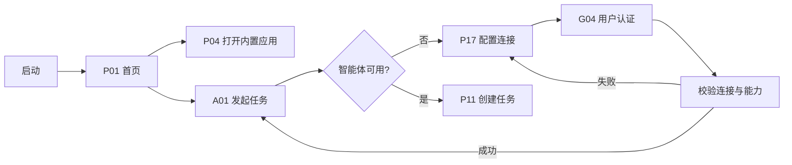
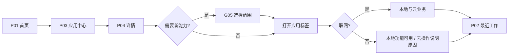
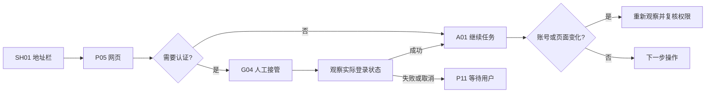
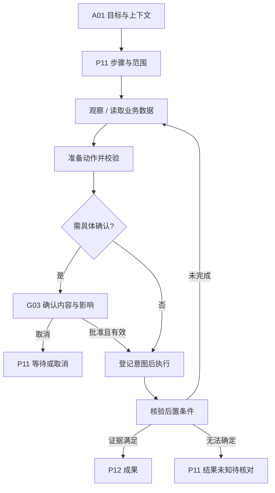
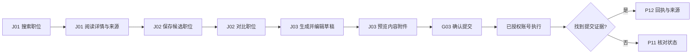
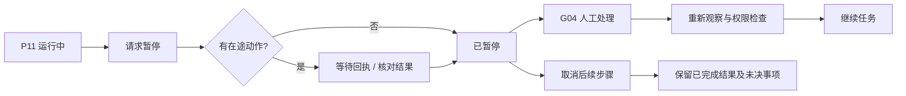
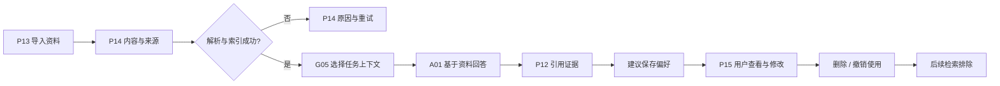
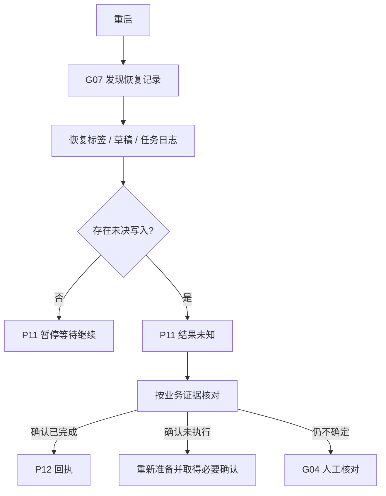
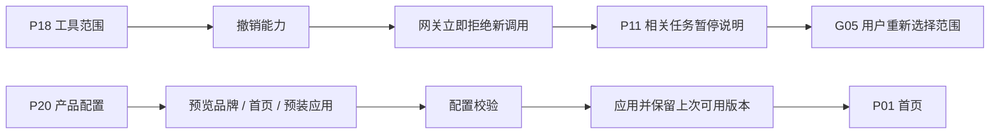

# 端到端交互流程

每条路径引用注册的功能。节点中无编号的文字是处理步骤，不是新页面。全局面取消返回实际来源并保留上下文。

## F01 首次进入与配置

首次启动无需配置模型就能进入本地首页。Agent 未就绪才引导配置；网站登录与模型认证分别管理。

异常与恢复：配置取消返回首页；错误保留配置但不保存明文密钥；连接成功后恢复待发送内容，不自动提交。

## F02 应用打开与离线

首页快捷入口与应用中心指向同一应用记录。打开应用不等于获得所有本地能力。

异常与恢复：拒绝授权仍可返回详情；依赖被拒能力的按钮明确不可用；包加载失败提供重试，不能伪造空业务成功页。

## F03 浏览、登录与人工接管

用户在可见的 Servo 页面完成认证；Agent 继续使用同一受控 profile，须重新观察登录结果。

异常与恢复：弹窗登录、跨域重定向、认证过期与重启恢复均需 Servo 实测；不支持的站点明确记录，不承诺任意网站可用。

## F04 Agent 执行闭环

用户目标变为可见任务。写入批准绑定具体对象、内容和账号；普通已授权只读动作不重复打断。

异常与恢复：过期目标、权限变化或内容变化都返回重新准备；模型文字、点击回执或 HTTP 200 不能充当业务成功证据。

## F05 职位业务完整路径

招聘是首个内置应用案例，核心浏览器与 Agent 不硬编码职位字段。

异常与恢复：搜索筛选、保存偏好不等于提交授权。站点无提交能力时保留草稿供人工使用；验证站点账号前不把演示数据当真实职位。

## F06 暂停、接管与取消

暂停阻止新的动作；正在发送的操作可能已经生效，状态必须如实表达。

异常与恢复：取消不撤销已提交申请；需要补偿时产生独立可审查动作。接管期间 Agent 不与用户争夺页面输入。

## F07 知识、引用与记忆

资料是原始内容，记忆是有来源和范围的可编辑事实，两者独立管理。

异常与恢复：来源被删后旧成果保留允许保留的摘要及来源失效标记；不能悄悄改旧结论。凭据不得进入资料记忆。

## F08 崩溃与未决提交恢复

恢复优先保证不重复产生外部副作用。

异常与恢复：重启不会恢复已过期确认和旧节点句柄；恢复窗口关闭后，未决事项仍在任务中心可找到。

## F09 权限撤销与产品配置

用户可以撤销具体能力；产品默认配置不能放大用户已有授权。

异常与恢复：产品配置为 V1.1；本期不会因规划该入口就创建可执行插件市场。配置失败保持上次可用版本。
