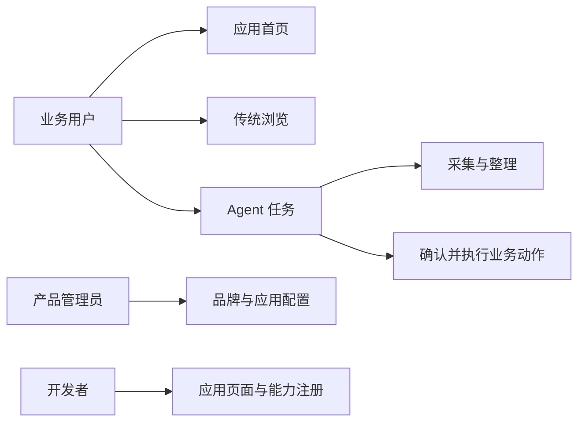
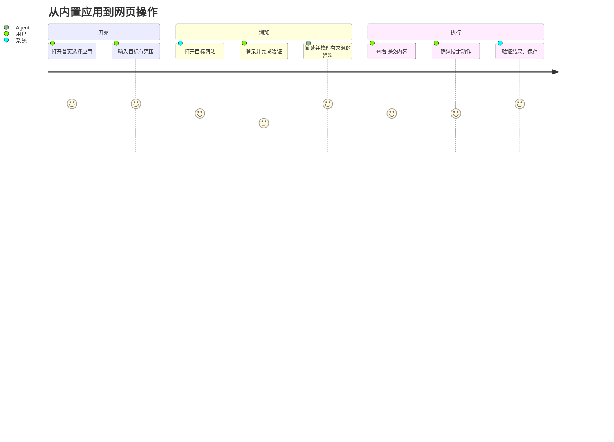

# 产品规格 v0.1

状态：待实施的文档基线。用户已确定产品方向与参考图；本文新增的范围、验收门槛和实现细节是建议基线，不能视为用户逐条批准。唯一需求事实源；其他文档不得扩大需求。

## 目标与非目标

构建可定制的 Agent 浏览器桌面客户端。用户既能正常浏览网页，也能打开内置业务应用，通过 Agent 完成跨页面、跨应用任务。招聘只是首个示例领域，不应写进浏览器核心。

首期以 macOS 开发验证，Windows/Linux 列为后续发布目标，均需各自证据；移动/平板仅规定设计适配，不承诺首期原生发行。

不以绕过网站风控为目标；不承诺所有网站兼容或 Chrome 扩展生态；不开发完整密码管理器、插件市场、跨设备同步、任意第三方本地代码执行。首期不训练模型、不强制向量数据库，不将所有业务产品迁移纳入本仓库。

## 人员与使用场景

| 角色 | 目标 |
|---|---|
| 业务用户 | 首页打开应用、登录网站、保存并比较业务信息 |
| 自动化用户 | 交代目标、观察执行、暂停和接管、确认提交 |
| 产品管理员 | 配置品牌、应用、默认首页和能力范围 |
| 开发者 | 将业务页面和结构化能力注册到平台 |

## 功能与可观察验收

所有条目目前均未实现。

| ID | 需求 | 验收行为 |
|---|---|---|
| FR-01 | 应用首页 | 启动显示首页；点击已安装应用打开正确标签；最近工作可重新进入 |
| FR-02 | 传统浏览 | 新建/关闭/切换标签，地址导航、前进后退、刷新停止；书签、历史和下载可访问 |
| FR-03 | 内置应用 | 无网络仍打开打包页面并读写本地数据；云功能显示离线状态 |
| FR-04 | 本地能力 | 已授权页面调用指定 Rust 能力成功；外部页面和越权参数被拒绝 |
| FR-05 | 网站账号 | 用户手动登录后 Agent 在相同会话操作；账号隔离；重启与过期场景可解释 |
| FR-06 | 页面观察操作 | 观察产生有版本的目标；页面改变时旧目标被拒绝，重新观察后执行 |
| FR-07 | 任务生命周期 | 目标、步骤、证据、暂停/取消/接管可见；关闭标签不静默取消独立后台任务 |
| FR-08 | 对外提交 | 展示对象、内容与附件；批准与摘要绑定；结果不明时进入核对而非重发 |
| FR-09 | 业务能力 | 示例提供搜索、详情、保存职位、申请草稿与已确认提交；核心不依赖招聘字段 |
| FR-10 | 记忆与来源 | 保存偏好、来源和有效期；用户可查看删除；不得保存会话凭据到模型记忆 |
| FR-11 | 产品定制 | 不修改引擎代码即可改变品牌、首页、预装应用和默认策略；不能扩大既有授权 |
| FR-12 | 运行恢复 | 进程故障后恢复任务记录；在途外部写入标为未知；不展示虚假成功 |

## 非功能要求

- NFR-01：外部网页、内置应用、宿主本地服务有可验证的权限边界。
- NFR-02：性能以全进程实际测量；不预设“比 Electron 节省百分之多少”。性能目标见评估文档，尚未通过。
- NFR-03：执行有 trace/task/action 关联，敏感数据默认脱敏，记录可导出和删除。
- NFR-04：参考图保留约 2:1 宽屏构图；缩窄视口用折叠/抽屉适配，不横向拉伸。
- NFR-05：每个平台独立验证中文输入、键盘、焦点、缩放、无障碍、签名及升级。

## 用户旅程

## 首期端到端场景

自有招聘示例打开本地候选职位库 → 用户打开受测网站并登录 → Agent 提取指定职位 → 来源与账号标识绑定 → 保存职位 → 生成申请草稿 → 用户查看具体内容 → 在测试站点提交并核对回执。真实网站有副作用的验收必须使用明确授权的测试账号与动作；没有这些条件应标未验证，不能用模拟数据冒充。

## 本次实施切片：浏览器外壳 + 内置工作台（2026-09-29）

用户已授权开始实现参考图的真实客户端。本次保留完整产品目标，先实现可启动的 Servo 桌面宿主与内置网页：真实导航/标签状态、青绿色宽屏外壳、职位搜索筛选/详情/收藏/对比、本地应用入口及 Agent 面板交互。参考图中的模型执行状态不得伪装成真实联网推理；未接模型时明确显示本地示例能力。

验证必须包含 Servo 实际运行与可见界面，不允许用 Chrome 预览替代 Servo 验收。当前切片不自动代表其余 FR、安全沙箱、多账号或跨平台发行已完成。

## 功能设计分解 v0.2

技术方向按用户最新确认：Rust + Servo + 本地/远端网页 + Rust 本地能力 / 远端 API，Codex 为内嵌智能体载体。原 AgentScope 默认接入方向已替代。界面保持青绿色参考图与真实浏览器外壳能力。

[详细功能设计](functional-design/README.md)将上述 FR/NFR 分解为导航、24 个页面职责、全局面、操作与状态。它是本规格的设计展开，不是另一份需求来源。产品配置作为 V1.1 规划；真实登录与提交必须逐站点验收。所有设计单元初始为 Draft，文档存在不等于批准或实现。
