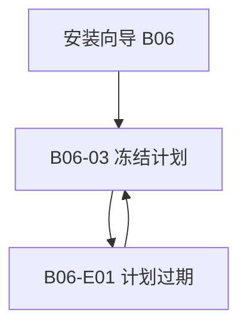

# 导航与界面结构

## 父页和上下文

B06 安装向导是运行环境域内流程，由既有来源/目标选择进入，不新增一级菜单。本切片从来源/目标已选择处开始。顶栏显示来源、目标和范围；步骤栏标记当前为计划预览。

## B06-03 布局

页头：计划 ID、来源版本、目标数量；主体左区：逐目标文件差异；主体右区：风险、权限、备份引用；底部：继续至既有审批流程、返回选择。计划无效时继续按钮禁用并给出原因。长差异区独立滚动，页头和动作可达。

## 异常及返回

B06-E01 保留原差异，顶部说明哪个对象变化并突出“重新预览”；不能通过关闭错误恢复旧计划有效性。返回选择保留草稿；更改目标后旧计划失效。键盘关闭异常后焦点回到重新预览动作。

双端采用同一信息结构和状态；1280×1024 为原项目设计条件，不能推广为其它项目的固定尺寸。
