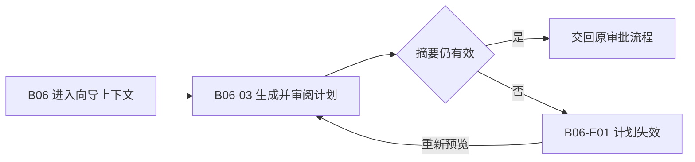

# 用户流程与状态

## J-F07 审阅计划并处理过期

前提：输入完整且有预览权限。成功终点：得到有效的计划预览，可进入原项目已有审批流程；本切片不执行审批或写盘。

| Surface | 动作 | 状态变化 | 成功 | 失败 |
| --- | --- | --- | --- | --- |
| B06 | 进入预览 | 已选择输入→生成计划 | B06-03 | 保留草稿并指出缺少输入 |
| B06-03 | 查看差异并校验 | 可预览→有效/过期 | 有效计划可交审批流程 | B06-E01 |
| B06-E01 | 重新预览 | 旧计划失效→新计划 | B06-03 展示新摘要 | 保留失效标识，可返回选择 |

失败：显示目标和原因，禁止旧计划继续。拒绝：权限不足不可读取目标内容。取消：退出预览，保留草稿，无安装副作用。离线：需要远端来源刷新时说明不可校验，不冒充最新版本。冲突：来源/文件/目标版本变化使旧计划失效。中断：重开重新检查输入摘要。恢复：重算计划，不能复用旧审批。
