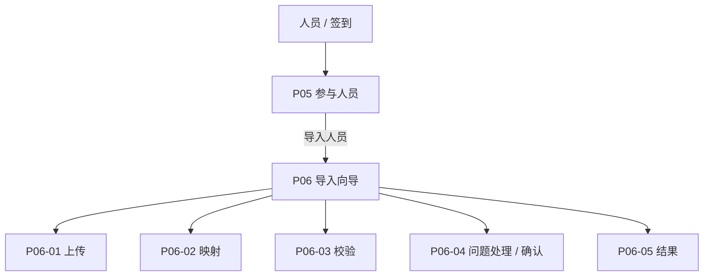
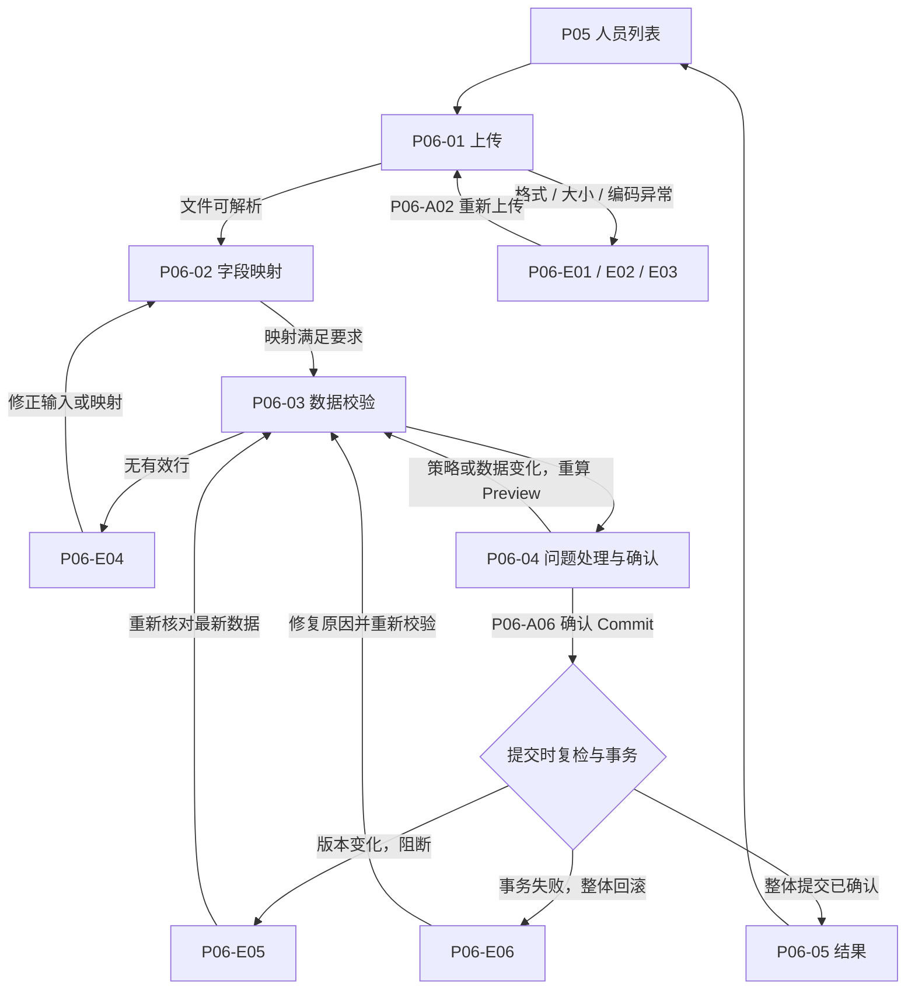

# 主示例：把 Evently「导入参与人员」整理成详细功能设计计划

这是本技能的**主要学习案例**：从真实功能规格出发，逐步得到功能清单、页面结构、交互流程、Surface 和任务说明。阅读顺序就是执行顺序。迁移到其它产品时，复用写法与深度，重新查证业务内容。

## 00 范围与依据

原文可离线查看：[原成果摘录](evently-source-excerpts.md)，对应[来源记录](evently-source-provenance.json)。另外参考 [P02 原 Registry](evently-p02-source.md)理解同一方法如何用于活动生命周期。

| 依据 | 可确认内容 | 不能据此宣称 |
| --- | --- | --- |
| P01–P15 功能规格的 P06 段 | Event 作用域、人员管理权限、Preview→Commit、事务失败整体回滚、成功返回 P05 | 导入功能已实现或运行通过 |
| Tenant Console Registry 的 P06 段 | 5 个向导视图、7 个动作、6 个错误的原编号 | 每个编号都已有批准设计稿 |
| Frozen Navigation 的结构与归属段 | P05–P09 归属“人员 / 签到”，向导不新增导航项 | 历史视觉条款仍然全部有效 |
| P02-A11 原设计任务 | 单项任务明确父功能、必需业务字段和交付目标 | 其具体宽度、主题、图像审批规则适用于所有产品 |

**证据边界：** 以下“原规格”均来自上述来源。“教学展开”是为了演示如何补足交互/布局/验收而提出的设计，不代表已经获得 Evently 产品批准。`F-P06-*`、`J-P06`、`D-P06-*` 是本教程局部标识，不写回原项目；`P06-*` 是原 Registry ID。本文件是完整方法的教学章节，不是一个经过 ready 校验的全产品交付包。

本例覆盖 P05 入口、P06 全部导入步骤及返回；P05 列表、P10/P11 排座为边界页面，不展开其完整产品设计。全量任务不能用这个切片替代其它模块的逐项整理。

## 01 功能总表与模块详细规格

### 模块规格：P06 导入参与人员

- **核心用户：** Organizer 或具备 Manage Participants 权限的成员。
- **Scope / Context：** 当前 Event；导入的是参与人员配置，不是某个 EventSession 的签到事实。
- **业务问题：** 把 Excel/CSV 的人员数据安全纳入活动名单，在写入前看清映射、重复、错误和处理结果。
- **入口：** P05“导入人员”；大尺寸或全屏向导，侧栏仍选中“人员 / 签到”。
- **前置条件：** 目标 Event 明确、具备管理权限；文件限制等政策按现行规格核实。
- **必须展示：** 文件信息、源列映射、必填字段、有效/重复/缺失/格式错误/未知部门/桌位冲突计数、逐条问题与处理策略、最终新增/更新/跳过数量。
- **主要操作：** 上传、确认映射、复核问题、确认 Commit；下载模板/报告、保存映射、返回和取消为相应步骤的辅助操作。
- **业务边界：** 两阶段 Preview→Commit；上传不能立即写入正式名单。正式名单不允许部分成功；预览中跳过部分行不等于提交部分成功。导入应幂等并记录 Audit。
- **失败与恢复：** 文件错误先修复输入；版本变化必须重新核对；事务失败整体回滚。不能以成功 Toast 代替最终名单结果。
- **上下游：** P05→P06→P05；成功后可以继续 P10/P11 排座，但不能自动宣称已完成排座。

### 功能清单

以下子功能拆分为教学整理；行为根据原规格归纳。

| 功能 ID | 目标与输入 | 规则及输出 | 界面/动作 | 可观察验收 |
| --- | --- | --- | --- | --- |
| F-P06-01 文件准备 | 选择 Excel/CSV，或下载模板后填写 | 显示文件与解析信息；预览前不改正式名单 | P06-01、A01、A02 | 文件错误有明确原因与重新上传入口，名单保持原状 |
| F-P06-02 字段映射 | 把源列对应到目标字段 | 显示必填要求；允许保存映射模板 | P06-02、A03 | 映射可检查，未满足必填规则时不能继续 |
| F-P06-03 校验与处理 | 复核摘要、冲突行及处理策略 | 合并/覆盖/跳过或逐条修正后重新核对 Preview | P06-03、P06-04、A04、A05、A07 | 逐行处理与最终新增/更新/跳过汇总一致 |
| F-P06-04 原子提交与结果 | 提交确认后的 Preview | 复检版本；幂等、有 Audit；全部提交或全部回滚 | P06-04、P06-05、A06、E05、E06 | 成功事实可核对；失败不会留下部分正式名单修改 |

表内 A/E 为同一 `P06-` 前缀的简写；实际索引写完整 ID。权限、作用域和两阶段规则继承上方模块详规，不能脱离模块单独解释这些行。

### 关键字段：写到什么深度

以下为**教学展开**，演示在 01/04 中要达到的颗粒度；具体字段模型尚需现行产品规则确认。

| 字段/信息 | 展示或输入 | 必填/校验 | 用户据此决定什么 |
| --- | --- | --- | --- |
| 当前活动 | 只读对象标识 | 必须与 P05 来源一致；提交前再次核对 | 名单将写入哪个活动 |
| 文件名、类型、大小 | 上传后展示 | 格式、容量和解析校验；不编造具体上限 | 是否选错文件或需要处理文件 |
| 源列、样例值、目标字段 | 映射表 | 必填目标必须有来源；允许组合映射与否需确认 | 哪一列会写入什么字段 |
| 有效/重复/缺失等计数 | 校验摘要与问题筛选 | 各分类是否重叠、计数口径需确认 | 是否可以继续、先修哪些问题 |
| 问题行、原因、当前/候选值、策略 | 问题表与编辑区 | 合并键、覆盖保护字段、策略默认值需确认 | 修正、合并、覆盖还是跳过 |
| 新增/更新/跳过数量 | 提交前汇总和结果对照 | 来源为当前 Preview；修改策略后重新计算 | 确认本次会产生哪些变化 |

**待确认清单：** 文件容量上限、支持的表格细类/编码、人员唯一键、字段必填规则、合并和覆盖语义、Preview 保存时长、断网后提交结果查询方式。原文没有给出的值不能靠示例补成已确认需求。影响设计或实现的条目保留 blocker，并明确影响的任务。

## 02 导航与页面结构

### 页面归属



这个图表示归属，不表示所有步骤可以任意跳转。P06 不增加一级菜单；五个视图是同一流程的步骤/结果。全局 Tenant/Event 上下文沿用产品外壳。

### 布局草图（教学展开）

```text
┌ 全局 Header：品牌、Tenant、当前 Event、全局入口 ┐
│ 侧栏：人员 / 签到                              │
│  ┌ 主体标题：导入参与人员 + 返回名单            │
│  │ 当前活动 + 文件摘要 + 当前处理状态          │
│  │ 步骤：上传 → 映射 → 校验 → 确认            │
│  ├ 当前步骤工作区（见下表，长内容在这里滚动）  │
│  │                                            │
│  └ 操作区：取消 / 上一步        当前步骤主动作 │
└───────────────────────────────────────────────┘
```

原功能规格有四个处理步骤，Registry 另列 P06-05 结果视图：结果不增加一个输入步骤。本教学采用外壳内全屏工作区；是否用大型弹层仍由目标项目设计决定，不从示例推导固定尺寸。

| 视图 | 第一屏问题 | 主体结构与必需内容 | 主/次操作 | 状态变化位置 |
| --- | --- | --- | --- | --- |
| P06-01 | 是否选对文件，格式能否处理？ | 模板说明→上传区→文件名/大小/解析反馈 | 主：解析并继续；次：下载模板、重新上传、取消 | 文件错误位于上传区，保留活动上下文 |
| P06-02 | 每一列将写入哪里？ | 文件摘要→源列/样例/目标字段映射表→必填检查 | 主：校验数据；次：保存映射、上一步、取消 | 缺失映射就地标注；不可隐藏在通用 Toast |
| P06-03 | 哪些数据有问题，数量是多少？ | 校验摘要→分类筛选→问题/有效行明细 | 主：处理问题并复核；次：错误报告、返回映射 | 解析/无有效行原因及恢复动作在主工作区 |
| P06-04 | 解决策略正确吗，这次将改多少人？ | 问题行与策略→修正区域→最终影响汇总→确认 | 主：确认导入；次：返回校验、报告、取消 | 提交期间操作区显示处理中；版本/回滚错误保留对应上下文 |
| P06-05 | 哪些变化已确认，接下来去哪？ | 结果状态→新增/更新/跳过汇总→可核对记录→下一步 | 主：返回 P05；次：按权限继续 P10/P11 | 成功使用已确认结果；不能把本地 Preview 当成功记录 |

教学建议：长表格滚动时保留列头与操作可达性；步骤变化后焦点进入当前标题，错误与具体行关联；返回来源后恢复合理焦点。窄视口的列优先级、键盘/触摸规则应在目标项目补充，不能由“响应式”三个字代替。

## 03 用户旅程与交互流程

`J-P06`：具备权限的成员从 P05 发起，目标是安全导入当前 Event 名单并返回核对。



错误的具体返回交互和处理中表现属于教学展开；Preview→Commit、版本错误、整体回滚与返回 P05 是原规格。图中 `COMMIT` 是业务处理节点，不新增一个页面编号。

### 操作转换表（教学展开，需真实项目确认）

| 起点/动作 | 前置检查与效果 | 成功/下一步 | 失败/取消与数据处理 |
| --- | --- | --- | --- |
| P05 → 进入 P06 | 校验目标 Event 与权限；不改名单 | P06-01 | 无权限留在来源并说明，不打开可编辑空向导 |
| P06-01 / A01 下载模板 | 使用适用版本模板，不写名单 | 留在上传步骤 | 下载失败可重试，不误报导入失败 |
| P06-01 / 上传或 A02 重传 | 文件校验、解析；重传使旧映射/Preview 重新校验 | P06-02 | E01/E02/E03；可更换文件，名单不变 |
| P06-02 / A03 保存映射模板 | 校验映射；保存映射配置不等于导入人员 | 留在 P06-02 | 保存失败保留编辑内容；模板作用域待确认 |
| P06-02 / 继续校验 | 必填映射满足要求，生成 Preview | P06-03 | 字段错误就地处理；E04 回修正输入/映射 |
| P06-03 / 进入复核 | 用户能查看摘要及问题明细 | P06-04 | 预览失效需要重算；取消不改名单 |
| P06-04 / A04 策略、A05 修正 | 应用到 Preview，重新计算问题与影响 | P06-03/04 往返复核 | 不满足规则保留问题说明；不得悄悄写正式名单 |
| P06-03/04 / A07 错误报告 | 基于当前校验版本生成报告 | 当前步骤 | 下载失败可重试；隐私字段范围待确认 |
| P06-04 / A06 确认 Commit | 复检权限、Event、版本；幂等与事务控制 | P06-05 | E05 重建/复核预览；E06 已回滚后修复重试 |
| P06-05 / 返回或排座 | 返回当前 Event，按权限导航 | P05 或 P10/P11 | 跳转失败保留结果，禁止重新提交导入 |
| 提交前 / 取消或返回 | 正式名单不变；明确当前草稿处理 | 前一步或 P05 | 草稿保留时长和关闭确认策略待决，不擅自声称已保存 |

**横切分支：** 提交前断网保留可用输入并阻断需要联网的校验；提交后超时不能推断已回滚，必须先确认提交结果再决定重试；权限被撤销应阻断新提交并保留可说明的状态；提交后关闭页面不等于撤销事务。后两类恢复的接口与政策原文未给出，必须登记待决，不能假设已有实现。

## 04 Surface Registry 的整理方式

原成果列出的 **18 个 P06 Surface** 全部保留；不为凑图片数量额外拆分。

| 类型 | 原 ID | 内容与承载方式 |
| --- | --- | --- |
| 向导/结果视图 | P06-01、P06-02、P06-03、P06-04、P06-05 | 上方逐页结构表及主链 |
| 辅助动作 | P06-A01、P06-A02、P06-A03、P06-A07 | 模板、重传、保存映射、错误报告；不自动新增弹窗 |
| 业务动作 | P06-A04、P06-A05、P06-A06 | 策略、修正、提交；明确 Preview 与 Commit 分界 |
| 文件错误 | P06-E01、P06-E02、P06-E03 | 格式、容量、编码/解析，上传区可恢复 |
| 校验错误 | P06-E04 | 无有效行，回到输入/映射修正 |
| 提交错误 | P06-E05、P06-E06 | 版本变化阻断、事务失败整体回滚；不是同一种失败 |

**展开示例：P06-E05**（教学设计详规）

- 父功能 P06；关联 F-P06-04；来源 P06-04 点击 P06-A06 时的版本复检。
- 核心问题：当前确认的 Preview 已失效，如何核对最新名单后安全重试？
- 必需信息：目标活动、受影响预览、变更原因/可用摘要、明确“本次提交被阻断”；不得把旧预览显示成已成功写入。
- 结构：保留当前活动和向导上下文；主体显示版本冲突说明与重新校验入口；旧影响汇总标失效。
- 主操作“重新校验最新数据”；次操作“返回人员列表”。前者回 P06-03，后者回 P05。
- 操作前再次检查权限；新 Preview 就绪前禁用再次 Commit。哪些输入能保留、如何对比版本需产品/API 合同确认。
- 成功：生成新校验结果，由用户重新复核；失败：仍处于阻断，保留可解释原因和恢复入口。
- 焦点进入错误标题，提供键盘可达的恢复动作；不能仅用颜色表达失效。
- 视觉依赖：继承 P06-04 的外壳与上下文；只替换冲突信息和允许操作，不重新编排导航。
- 验收：旧 Preview 无法再次提交；重新校验后不会自动确认；返回列表不触发导入。

正式交付需对所有 Surface 按统一模板展开；本教学对其余条目以结构表与转换表示范，不宣称已逐项形成生产设计规格。

## 05 计划任务：从规格推出工作，不能从截图倒推需求

以下为**教学计划**，不修改 Evently 现有任务编号、状态或权限。真实执行时先定位原任务并补缺口，不能复制为第二套实施清单。

| 教学任务 | 内容与覆盖 | 依赖 | 责任角色 | 产物与验收/验证 |
| --- | --- | --- | --- | --- |
| D-P06-00 | 确认字段、合并、文件、恢复等待决合同；覆盖 F-P06-01～04 | 无 | 产品/后端 | 在正式规格记录决策及依据；逐条检查待决影响 |
| D-P06-01 | P06-01、A01、A02、E01～E03：上传及错误 | D-P06-00；既有外壳 | 设计/前端 | 页面分区、文件校验和恢复；有效/格式/容量/解析夹具走查 |
| D-P06-02 | P06-02、A03：字段映射 | D-P06-01 | 设计/前后端 | 映射表及校验、模板操作；必填缺失与保存失败场景 |
| D-P06-03 | P06-03/04、A04/A05/A07、E04：校验、问题处理 | D-P06-02 | 设计/前后端 | 问题摘要/明细/策略/影响汇总；修正后重算且名单不变 |
| D-P06-04 | A06、P06-05、E05/E06：提交和结果 | D-P06-03 | 前后端/测试 | 提交、版本阻断、回滚、结果与返回；事务/重复请求用例 |
| D-P06-05 | J-P06 全链与 18 个 Surface 覆盖验收 | D-P06-01～04 | 产品/设计/测试 | 覆盖矩阵及实际证据；逐项核对功能、流程、结构和副作用 |

实际任务可按设计、实现和验证阶段细分；上表的角色不是人员指派，也不表示并行启动。以原任务源的依赖及权限为准。

### 执行说明实例：D-P06-04

- **任务目标：** 把确认导入到成功/版本变化/事务回滚的结果链写清并交付；输入文件、映射编辑由上游任务负责。
- **输入：** P06 原规格、Registry、已确认业务政策、P06-04 父页、当前 Preview 与提交用例；没有确认的恢复规则必须先解决 D-P06-00。
- **对象/入口/导航：** 当前 Event；从 P06-04 的“确认导入”进入；选中“人员 / 签到”。
- **第一屏问题：** 本次会改什么、是否已确认完成、失败后如何恢复？
- **布局与必须内容：** 原活动上下文 + Preview 影响汇总 + 提交状态 + 对应结果/错误 + 可执行下一步；绝不能只放通用成功卡片。
- **动作转换：** A06 成功→P06-05→P05；版本变化→E05→P06-03；事务失败且已回滚→E06→修复与重新校验；未知结果需先确认状态，不能一键重复写入。
- **状态：** 可提交、处理中、成功、版本阻断、已回滚及待确认的结果未知恢复。禁用原因和重复点击行为必须明确。
- **设计依赖：** 引用 P06-04 父页；冻结全局导航、对象与已有分区，只变化提交反馈和结果区域。真实母稿路径/视觉批准按项目核对，不沿用教程的批准状态。
- **产物：** 唯一规格源的对应章节/任务记录、相关 Surface 设计说明、交互映射和测试证据索引；实际图稿命名遵循项目已有规则。
- **验收：** 成功数量与提交事实一致；E05 不使用旧 Preview 自动重试；E06 名单完全回到提交前；关闭页面不等于撤销；返回列表不重复导入。
- **验证：** 使用固定样本覆盖成功、并发版本变化、事务内故障、重复请求与响应丢失；分别记录设计走查、后端数据及运行证据。教程没有执行这些测试。

这个任务继承 Evently P02-A11 的“目标、上下文、业务内容、父页依赖、动作和验收”写法，并把原任务中泛化的“依 Registry”展开为具体去向。不同业务不可照抄其 40vw 抽屉、色彩或单图交付要求。

## 06 审阅与接续

| 主线 | 本例已展示 | 真正项目还要完成什么 |
| --- | --- | --- |
| 功能清单 | 模块详规、4 项教学子功能、原规则与待决分开 | 确认字段及策略；其它模块按相同深度展开 |
| 交互流程 | 主链、逐动作转换、6 个错误与横切分支 | 把教学交互与恢复政策纳入现行规格确认 |
| 界面结构 | 导航归属、5 个视图分区、主次动作、E05 详规 | 全部 Surface 详规、目标视口与视觉验收 |
| 计划任务 | 原 ID 覆盖、依赖、执行说明、具体测试方法 | 对齐原任务源、执行后再记录真实证据 |

**结论：** 本例可用于学习写法，Evently P06 的生产规格与实现状态仍需实际核验；未确认项不能标 ready。换一个智能体接续时，先核对 00 与待决项，再按依赖拿一项任务；有新决定时同步 01–05 的对应条目，最后复查 06。不要重做整套编号，也不要从生成几个界面开始。
