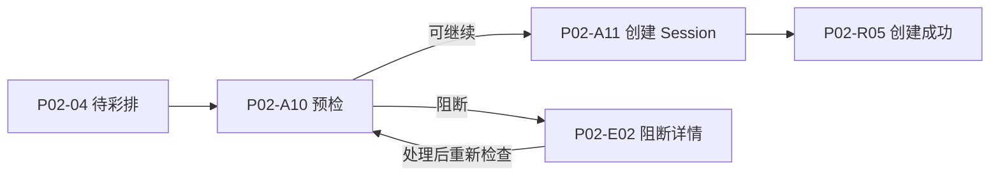

# Evently：把一个功能页展开成可交付交互

## 原始成果

见[原文摘录](evently-p02-source.md)。原 P02 属于活动管理，目标是管理企业下全部活动生命周期，包含 8 个稳定页签、动作、重要状态、阻断与结果。以下说明沿用原 ID；教学描述不是对原需求的新增批准。

## 从功能到界面

| 用户问题 | 原界面或动作 | 必须展开的内容 | 可迁移的方法 |
| --- | --- | --- | --- |
| 哪些活动准备好彩排了？ | P02-04 待彩排 | 准备度、缺失项、彩排时间、发起动作 | 业务页签有不同决策信息，不只是换筛选标题 |
| 能否启动彩排？ | P02-A10 预检 | 人员/流程/媒体/节点检查，Ready/Warning/Blocked | 将决定是否可执行的前置检查独立建模 |
| 创建哪一次彩排？ | P02-A11 创建 Session | 名称、计划时间、Snapshot 与确认 | 把配置与运行实例分开，确认界面有真实输入 |
| 创建后发生了什么？ | P02-R05 创建成功 | 新 Session 身份及后续入口 | 结果可追踪，不能只有成功 Toast |
| 为什么不能继续？ | P02-E02 彩排阻断 | 原因、受影响对象、去修复入口 | 错误必须有动作和返回链 |

这是对原 Registry 的旅程整理，不声称上游已经实现该链路。末端应在目标项目中补充已核实的 Session 详情入口，不能猜一个 ID。

## 如何写任务而不是只列页面名称

原 Evently 将 Surface 进一步拆成单项设计任务，并记录父页、允许变化区域与资产依赖。下面是可迁移的任务表达方式，任务名称是教学示意，不是 Evently 正式新增任务：

| 任务 | 输入 | 产物 | 依赖 | 验收 |
| --- | --- | --- | --- | --- |
| 整理彩排预检合同 | 已确认的检查项、权限和状态 | P02-A10 信息与动作定义 | 确认活动/Session 对象边界 | Ready/Warning/Blocked 各有解释及去向 |
| 设计创建 Session 交互 | 上一步合同、父页与字段规则 | P02-A11 的布局、字段校验、提交/取消状态 | 预检结果可继续 | 不丢原活动上下文，提交结果可定位 |
| 验证阻断和结果链 | A10/A11/E02/R05 规格 | 从待彩排到结果、修复再试的用例 | 上述定义完成 | 不能绕过阻断，不能重复创建，返回链完整 |

接入已有 Evently 时必须查其 MASTER-TASKS 与单项任务，引用原条目；不能直接把上表写成新的重复执行清单。固化的是任务字段和依赖方式，不是强制每个 Surface 恰好三个任务。

## 要保留与要避开的做法

保留：稳定 ID、局部页签不进入一级导航、创建/预检/结果拆开、重要状态有自己的内容、动作层保留父页上下文。

避开：仅列 P02 一张主图；把所有异常写成“失败请重试”；把页面生成当成功能开发；复制示例数量充当覆盖证明；将原项目“40% 抽屉”“冻结导航”等规则推广到所有产品。
