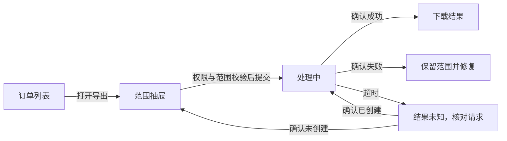

# 流程

```mermaid
flowchart LR
 List[订单列表] -->|打开导出| Scope[范围抽屉]
 Scope -->|权限与范围校验后提交| Running[处理中]
 Running -->|确认成功| Result[下载结果]
 Running -->|确认失败| Error[保留范围并修复]
 Running -->|超时| Unknown[结果未知，核对请求]
 Unknown -->|确认已创建| Running
 Unknown -->|确认未创建| Scope
```

取消返回当前列表/范围并恢复焦点；关闭页面不代表取消任务。演示要求幂等请求标识和状态查询，实际接入前验证后端支持。
