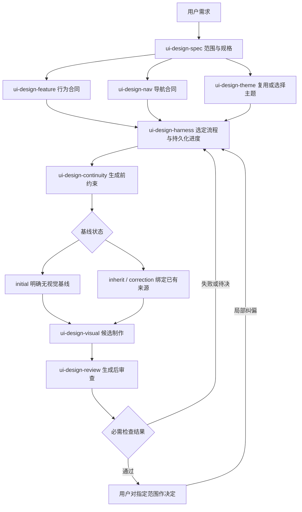

# 职责与交接合同

`ui-design-spec` 是用户入口与完整设计包维护者。`spec` / `execution` 是模式，不是新技能或新任务系统。交付结构固定，专业职责各自清晰，同一产物只有一个权威位置。

各专业步骤复用同一规格的版本化内容。图不表示每次都必须调用所有技能；既有运行根据自身 profile 执行。阶段处理器也可以是 ui-design-spec 的 baseline/task 处理，但不得重新进入统一路由。

## 唯一主要职责

| 技能 | 负责的决定/产物 | 明确不负责 |
| --- | --- | --- |
| ui-design-spec / spec | 完整设计包范围、组织、跨章节覆盖、逐页结构、总计划与交接；整合专业章节 | 不复制专业规则为另一套权威；不保存第二份 Harness run |
| ui-design-feature | 功能目标、角色、对象、规则、动作、状态、权限、验收；写回指定功能/页面章节 | 不重排导航、不制定视觉主题、不新建全产品文档包 |
| ui-design-nav | 导航层级、路由、选中态、上下文、深链与返回；写回指定导航/页面章节 | 不重定义业务行为、不将页签或动作擅自升级为一级菜单 |
| ui-design-spec / execution | 选择任务范围和工作流，准备跨专业交接合同 | 不管理运行锁、重试、租约或状态机 |
| ui-design-harness | 执行选定流程、调度、保存进度、恢复、对账与重试门禁 | 不负责重新定义功能/导航或每步重新选择模式 |
| ui-design-visual | 消费当前规格、主题及范围，生成 HTML 原型/视觉资产 | 不通过视觉探索改写功能、导航或用户已确认决定 |
| ui-design-review | 对照相同版本的规格、任务、资产，报告一致性问题与证据 | 不静默修复冲突、不作新的产品决定、不赋予用户批准 |

`ui-design-theme` 维护主题身份、版本与允许覆盖范围；`ui-design-continuity` 在生成前输出 initial/inherit/correction 约束；`ui-design-review` 在候选生成后执行差异检查。已有主题直接继承，首次页面明确记录视觉基线缺失。

## 一个设计包，专业内容就地补齐

- FUNCTION-CATALOG/pages 的行为规则由 feature 职责核实；NAVIGATION 和页面入口/返回由 navigation 职责核实。
- ui-design-spec 维护总目录、UI-STRUCTURE、跨页 USER-FLOWS、Registry、MASTER-PLAN 及交付状态，并引用专业章节。
- 已有需求文件、OpenSpec/Spec Kit 任务仍为原事实源；不得把同一需求抄为新 PRD 或独立勾选清单。
- 若 feature/navigation 技能已可用，必要时按职责使用；若不可用，ui-design-spec 可以按内置模板完成当前文档，不伪称已调用，不自动安装，不为了分工创建空壳文件。
- 独立请求“定义一个功能”或“修导航”可以直接使用专业技能；无需先调用统一入口或启动 Harness。
- 自查修正文案属于作者责任；跨产物审查交给 guard 后，其报告独立保留，不复制为新的需求事实源。

## 交接必须携带什么

使用现有 [任务合同](design-task-contract.md)，补齐：

| 信息 | 用途 |
| --- | --- |
| 请求范围与当前阶段 | 标明纯规格、视觉执行或已有 dispatch；不能从“继续”猜测扩大范围 |
| feature/page/Surface/task ID | 使用现行编号，同一对象跨技能不换号 |
| canonical source 路径 + 章节 + 版本 | 专业技能读取同一事实，不复制一个漂移副本 |
| 输入状态与未决项 | Draft、确认、实现和运行证据分开；未决项指出影响 |
| 任务源与唯一定位 | 使用现行任务行/编号；状态从原源读取 |
| 可改范围 / 固定范围 | 指明目标页、字段、动作、区域；跨域变化返回相应责任方 |
| 预期产物与验收 | 包括格式、内容、结果/异常及证据类型 |
| 有 run 时的 packet | 沿用 run_id、dispatch_id、scope、handler、evidence_stage、authority_versions；没有 run 不编造这些值 |

这些是工作交接内容，不要求修改 Harness 的 JSON schema；通过现有 authority/artifact/task 引用传递，依照当前 runtime 允许的字段。

## 消除循环路由

1. 用户直接请求完整文档 → ui-design-spec spec → 在原文档补齐 → 自查/可选 guard → 文档交付。
2. 用户要求设计执行 → ui-design-spec 选择一次流程 → Harness start/resume → 按现有 stage plan 调度。
3. Harness dispatch 的 handler 为 ui-design-spec → 只处理 `baseline` 或 `task` 指定产物 → 返回阶段证据；不再次调用 start/ensure-run 或总路由。
4. 恢复 run → 直接读取运行状态和 next-action。只有范围或上游权威发生实际变化时才进入相应纠偏/重新规划过程，不丢弃旧 run。

## 已有完整 spec 如何进入执行

保留 `product-to-ui` 原有 behavior/navigation/task 阶段。阶段读取已有合同，核对适用范围、版本与所需证据，满足时返回该阶段的验证证据及原产物引用；不足时补局部缺口。复用不是跳过门禁，不能因文件存在就直接写 pass。

`ui-design-spec` 的 task 阶段把原计划定位展开为可执行设计单元，使用同一任务 ID；Harness 保存自身运行状态，不回写未经实现的业务任务为完成。旧 run 的 profile/stage plan 不因技能文档改变而迁移。

## 接续示例

- “整理订单产品的功能设计” → spec；输出完整目录、逐页结构、失败与返回、任务依赖，停在文档交付范围。
- “把已确认的订单详情做成 HTML 原型” → execution；规格和导航有效时复用，renderer 只做指定页面。
- “继续上一条设计 run” → Harness 恢复；不得再次整理全产品定位。
- “这个原型与导航对不上” → guard 定位差异；规格歧义由 navigation 职责处理，视觉偏差由 renderer 按合同修正。

此处是可执行的技能指令合同；静态阅读或校验器通过不等于跨模型路由行为已验证。
